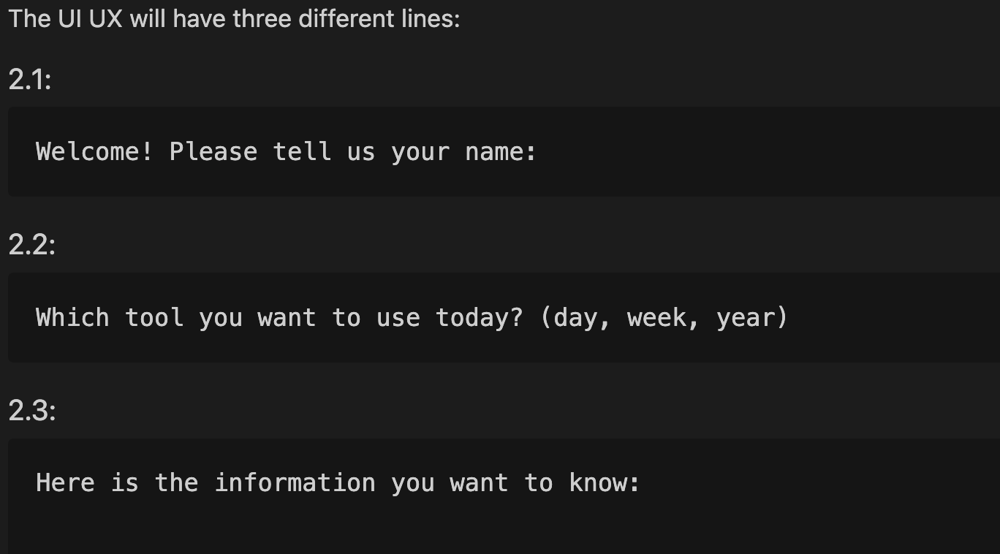

# 💻 Software Design

- Author: Jordan, Hsuan, Viet, Ziqi
- Reviewer: Kyle

## 🎯 Overview

---

- The main target of this project is to **design a calendar-related command line interface (CLI).**

## 📗 1. How this CLI works

---
There will be *four* main modules for the CLI to work, whose names are *Login,* *Register*, *Log*, and *Main*.  

### 1.1 Login

>- First there will be a login interface with two bars, the upper one is for users to input *username*; the lower one is for users to input *password*. Below these two bars, there should be one button for user to click in and register. At the lower right corner of the page is a ***"Finished"*** button indicating the user has finished inputting the information.

>- If the user enter the right username and passwords, jump to a page showing ***"Successful login! Welcome back!"***, and then open the log module with an ***"successful_login"*** input to record the user activities.

>- If the user enter the right username but wrong password, jump to a page showing ***"Wrong password, try again."***, and then open the log module with an ***"wrong_password"*** input to record the user activities. If the user clicked ***"try again."***, jump back to the login page.

>- If the user neither enter the right username nor the right password, jump to a page showing ***"Unsuccessful login, try again. If not registered yet, click here."***. If the user clicked ***"try again."***, jump back to the login page; if the user clicked ***"click here."***, jump to the register page.  

### 1.2 Register

>- The register page will first show ***"Please enter below messages to register."***, the rest part is the same as the two bars and the finish button at the first page.

>- If the account is already registered, jump to a page showing ***"Account already exists. Try again."***, and then open the log module with an ***"multiple_registration"*** input to record the user activities. If the user clicks ***"Try again."***, jump to the register page.

>- If the account is not yet registered, jump to a page showing ***"Successfully registered! Login."***, and then open the log module with an ***"successful_registration"*** input to record the user activities. If the user clicks ***"Login."***, jump to the first login page.

### 1.3 Log

>- If this function is called with an ***"successful_login"*** input, record the user login datetime, the username, and the activity as ***"successful_login"***

>- If this function is called with an ***"wrong_password"*** input, record the user login datetime, the username, and the activity as ***"login_with_wrong_password"***

>- If this function is called with an ***"multiple_registration"*** input, record the user login datetime, the username, and the activity as ***"multiple_registration"***

>- If this function is called with an ***"successful_registration"*** input, record the user login datetime, the username, and the activity as ***"successful_registration"***  

### 1.4 Main:  

>- Take the action user wants to do as the first input, and then ask for the username and password.

>- If the user wants to login, call the ***Login*** function.

>- If the user wants to register, call the ***Register*** function.

## 🖼️ 2. UI UX

---

### The UI UX looks like



## 🔍 3. How does each module look like

---

>We are going to build three different modules under the same directory, and then import them all into the main function to make the code looks tidier.

>**We will each commit and push the finished part on github and will merge them back to main branch to finish this product._**

### 3.1 Login module

```python
# File1
login(username, password):
    '''purpose of this function: Check if the login information is right, and link the login action to Log module.
    '''
    username = str, password = str
    return = str # return if the login is successful.

# File2
number_of_days(year, month):
    '''The function will return the total days in a specific month of the year. 
    
    We will build a python module leveraging _calendar.monthrange(year, month)_ to accomplish this requirement.
    '''
    year = int, month = int
    return = int

number_of_leap_years(year1, year2):
    '''The function will return the number of leap years between year1, and year2, including year1 and year2 if there are also leap years.
    '''
    year1 = int, year2 = int
    # We will do mathematical calculation like this:
    if year % 4 == 0 and (year % 100 != 0 or year % 400 == 0)
    return = int

get_week_of_day(year, month, day):
    '''The function will return what week the date is with the year. E.g., 01/08/2023 is week-2 of 2023, so the function will return 2.
    '''
    year = int, month = int, day = int
    date = datetime.strptime(date_string, "%d/%m/%Y")
    week_number = date.strftime("%W")
    year = date.strftime("%Y")
    return = int
```

### 3.2 Register module:  

```python
register(username, password):
    '''purpose of this function: Check if the register information is already there, and link the register action to Log module.
    '''
    username = str, password = str
    return = str # return if the register is successful.
```

### 3.3 Log module

```python
log(username, password, status):
    '''purpose of this function: After intaking the status from either login function or register function, combine the datetime, user's name, and activities into a string, and then open the log file and write them in.
    '''
    username = str, password = str, status = str
    return = str # return the result for user.
```

### 3.4 Main module

```python
main():
    '''purpose of this function: connect the other three modules and make this project work.
    '''
    input("Which action you wanna take?(Login or Register)")

    if Login:
        login()
    elif Register:
        register()
    else:
        return "Please enter again."
```
